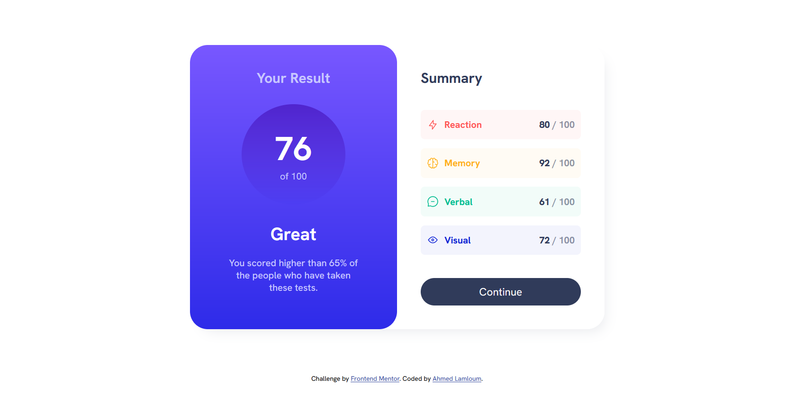
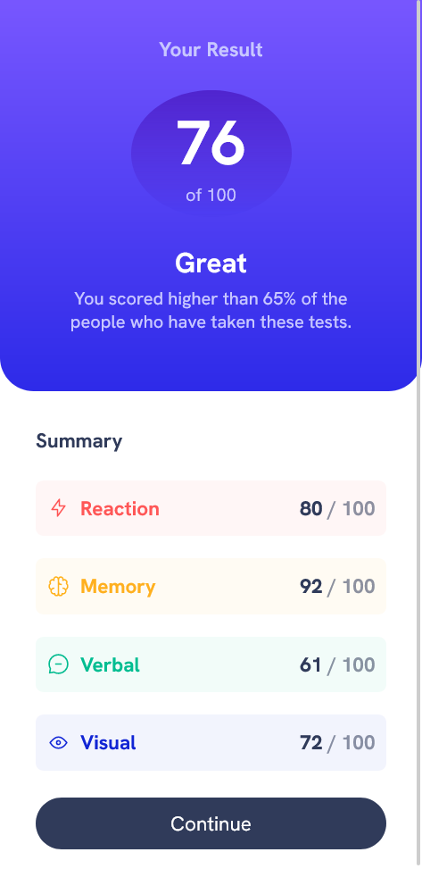

# Frontend Mentor - Results summary component solution

This is a solution to the [Results summary component challenge on Frontend Mentor](https://www.frontendmentor.io/challenges/results-summary-component-CE_K6s0maV). Frontend Mentor challenges help you improve your coding skills by building realistic projects.

## Overview

### The challenge

Users should be able to:

- View the optimal layout for the interface depending on their device's screen size
- See hover and focus states for all interactive elements on the page

### Screenshot

   

### Links

- Solution URL: [Add solution URL here](https://github.com/a-lamloum/FEM-results-summary-component)
- [Live Site Link](https://a-lamloum.github.io/FEM-results-summary-component/)

### Built with

- Semantic HTML5 markup
- CSS custom properties
- Flexbox
- Mobile-first workflow

## Author

- Website - [Ahmed Lamloum](https://a-lamloum.github.io/react-portfolio/)
- Frontend Mentor - [@a-lamloum](https://www.frontendmentor.io/profile/a-lamloum)
